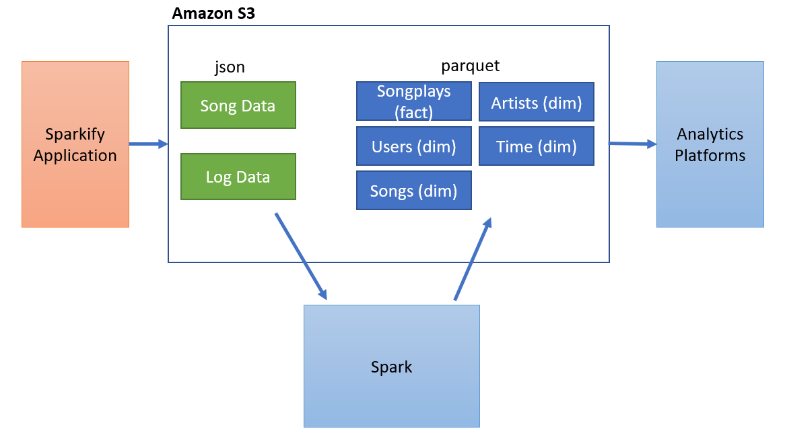
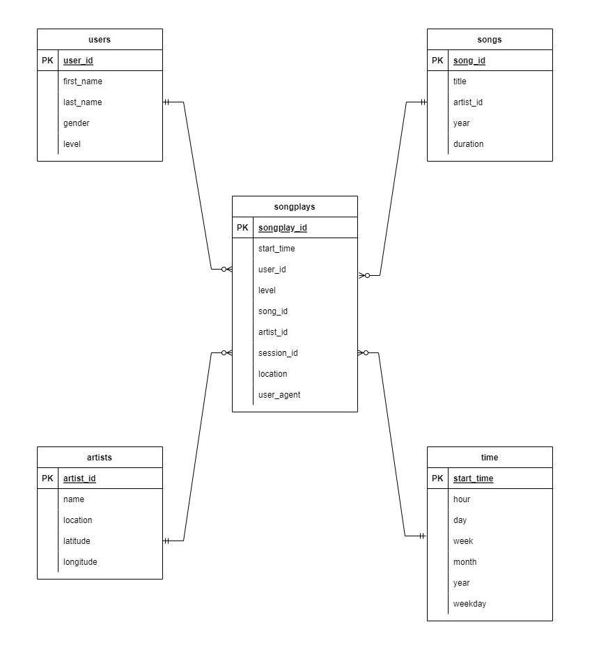

# Sparkify Data Lake

## Background
### Introduction
Sparkify is a fictional music streaming company. They have been operating for some time and collected logs on user activity and song data. With their growing user base and song database, they realize that the next step for the company is to move their data into data lake.

Their data resides in S3, in a directory of JSON logs on user activity on the app, as well as a directory with JSON metadata on the songs in their app. 

In this project, we are building an ELT pipeline using Spark that extracts their data from S3, processes them using Spark, and loads the data back into S3 as a set of dimensional tables. This will allow their analytics team to continue finding insights in what songs their users are listening to. 

They can use the data to build analytics dashboard for their management team to make decision, for example figuring out which artist they need to renew the contract, figuring out which music is most popular, etc. They can also use the data from S3 for advanced analytics, for example, they could build recommendation engine to suggest songs to their users.


### Project Architecture
In this project, we employ S3 as our data lake, storing raw data (songs and logs) and transformed data (song tables, artists tables, users tables, time tables, and songplays tables).
We use Spark to perform ELT to transform raw data into analytics-ready data.

Splitting storage (S3) and computation (Spark) allow us to reduce costs by turning off Spark once an ELT job is complete. However, processing speed may be slower than combined HDFS+Spark, since data must be loaded from S3 to Spark first.

By using Spark, we can process data in parallel, which speeds up the processing process. Sparkify's Data Scientist can also use Spark's machine learning techniques to gather insights.




### Analytics Table Design
The result of our ELT pipelines are several analytics table. Analytics tables are optimized for analytics purpose. They are designed using the star schema. The fact table is the songplays table. The dimension tables are songs, artists, users, and time tables. The analytics team could join the fact table and dimension tables, drill down, drill up to find the information they require.

These tables are stored in the form of parquet file. Parquet file is designed to support fast data processing (utilizing columnar storage) and optimal storage.




## Raw Data Overview
Sparkify stores their data in AWS S3 as json files.
The data consist of Log Data and Song Data

### Log Data
Log data records the user interaction with Sparkify application. 
It is stored in the following S3 bucket: [s3://udacity-dend/log_data](s3://udacity-dend/log_data). The log for each day is stored as a separate json file and put under the year and month folder.
```
log_data/2018/11/2018-11-12-events.json
log_data/2018/11/2018-11-13-events.json
```
This is how the content of a json file looks like:
```json
{"artist":null,"auth":"Logged In","firstName":"Walter","gender":"M","itemInSession":0,"lastName":"Frye","length":null,"level":"free","location":"San Francisco-Oakland-Hayward, CA","method":"GET","page":"Home","registration":1540919166796.0,"sessionId":38,"song":null,"status":200,"ts":1541105830796,"userAgent":"\"Mozilla\/5.0 (Macintosh; Intel Mac OS X 10_9_4) AppleWebKit\/537.36 (KHTML, like Gecko) Chrome\/36.0.1985.143 Safari\/537.36\"","userId":"39"}
{"artist":null,"auth":"Logged In","firstName":"Kaylee","gender":"F","itemInSession":0,"lastName":"Summers","length":null,"level":"free","location":"Phoenix-Mesa-Scottsdale, AZ","method":"GET","page":"Home","registration":1540344794796.0,"sessionId":139,"song":null,"status":200,"ts":1541106106796,"userAgent":"\"Mozilla\/5.0 (Windows NT 6.1; WOW64) AppleWebKit\/537.36 (KHTML, like Gecko) Chrome\/35.0.1916.153 Safari\/537.36\"","userId":"8"}
```

### Song Data
Song data records the details of the song.
It is stored in the following S3 bucket: [s3://udacity-dend/song_data](s3://udacity-dend/song_data). Each song is stored in a json file and placed under the first 3 letter of song track ID folders.
```
song_data/A/B/C/TRABCEI128F424C983.json
song_data/A/A/B/TRAABJL12903CDCF1A.json
```
This is the sample of the content of the json file
```json
{"artist_id":"ARIOZCU1187FB3A3DC","artist_latitude":null,"artist_location":"Hamlet, NC","artist_longitude":null,"artist_name":"JOHN COLTRANE","duration":220.44689,"num_songs":1,"song_id":"SOCEMJV12A6D4F7667","title":"Giant Steps (Alternate Version_ Take 5_ Alternate)","year":0}
```


## Project Files

### dl.cfg
A config file which list all the configuration required for this project

### Spark_data_lake.ipynb
A jupyter notebook file used for experimentation while building the ETL pipeline.

### etl.py
A python file to run the ETL job to a spark cluster.


## Getting Started
### Create an AWS Account
Please follow the instruction on this [link](https://aws.amazon.com/premiumsupport/knowledge-center/create-and-activate-aws-account/)

### Create an EMR Cluster
Create an EMR Cluster with the following settings:
- Software Configuration:
  - Release `emr-5.36.0`
  - Applications `Spark: Spark 2.4.8 on Hadoop 2.10.1 YARN and Zeppelin 0.10.0`
  - Go to advanced options, go to software configuration and tick `JupyterEnterpriseGateway 2.1.0` to ensure we can launch Jupyter Notebook in our cluster
- Hardware Configuration:
  - Instance m5.xlarge
  - Number of instances: 3
- Security and access
  - Select / create a new EC2 key pair, this will allow us to ssh to the cluster node later to submit spark job

Click `Create cluster` button and wait until it is ready

### Create an AWS S3 bucket
- Create an AWS S3 bucket in the same region as your EMR cluster
- Copy the bucket address 

- Put the bucket address value in `etl.py` file line 187.
For example:
```python
output_data_path="s3a://my-bucket"
```
- Put the bucket address value in `Spark_ELT_from_and_to_S3_data_lake.ipynb` cell 4:
```python
olap_tables_path ="s3a://my-bucket"
```

### Running notebook
- Go to the Amazon EMR dashboard
- Choose `Notebooks` and click `Create notebook`
- Give the notebook a name
- Choose cluster from existing one, the one we created before
- Click `Create notebook`
- Wait until the notebook is ready and click `Open Jupyterlab`
- Click the upload button and upload `Spark_data_lake.ipynb`
- Select `Pyspark` kernel
- Run the notebook


### Running etl.py as spark job in AWS EMR clusters
#### Find the URL to ssh to your master node
- Go to your AWS EC2 dashboard and view all the instances
- Click the instance ID of your cluster master node
- Click `Connect`, there will be an instruction on how you can ssh to the cluster master node, something like this
```commandline
ssh -i "xxx.pem" root@xxx.us-west-2.compute.amazonaws.com
```
- To ssh to the master node, we need to execute the command above, but replace the `root` username above with `hadoop`

#### Copy the etl.py file from your local machine to the spark master node
- Open a command line and go to the directory of this project
```commandline
scp -i ~/xxx.pem ./etl.py hadoop@xxx.us-west-2.compute.amazonaws.com:/home/hadoop
```

#### ssh to your master node
```commandline
ssh -i "xxx.pem" hadoop@xxx.us-west-2.compute.amazonaws.com
```

### submit the job to spark
```commandline
spark-submit etl.py
```

## Example of analytics query
***Get the top 10 artist***
```commandline
SELECT artists_table.artist_id as id,
    artists_table.name as artist_name,
    count(artists_table.artist_id) as count
FROM artists_table JOIN songplays_table
    ON artists_table.artist_id=songplays.artist_id
GROUP BY id, artist_name
ORDER BY count desc
LIMIT 10
```

This is the result that we will get:
```commandline
+------------------+--------------------+-----+
|                id|         artist_name|count|
+------------------+--------------------+-----+
|AR5E44Z1187B9A1D74|       Dwight Yoakam|   37|
|ARD46C811C8A414F3F|Kid Cudi / Kanye ...|   10|
|AR37SX11187FB3E164|          Ron Carter|    9|
|AR5EYTL1187B98EDA0|       Lonnie Gordon|    9|
|ARKQQZA12086C116FC|               B.o.B|    8|
|ARR3ONV1187B9A2F59|                Muse|    6|
|ARPDVPJ1187B9ADBE9|Usher featuring J...|    6|
|ARM0P6Z1187FB4D466|      Arctic Monkeys|    5|
|ARPN0Y61187B9ABAA0|          The Smiths|    4|
|ARVLXWP1187FB5B94A|     matchbox twenty|    4|
+------------------+--------------------+-----+
```


